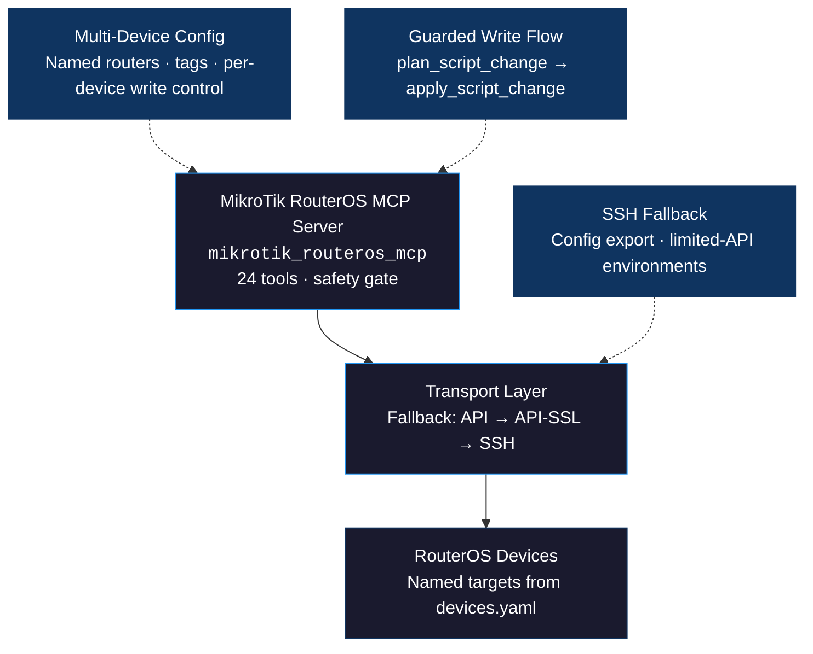

<p align="center">
  
</p>

# MikroTik RouterOS MCP

<p align="center">
  <a href="https://github.com/drohi-r/mikrotik-routeros-mcp/actions/workflows/ci.yml"></a>
  <a href="https://github.com/drohi-r/mikrotik-routeros-mcp/blob/main/LICENSE"></a>
  
  
</p>

An MCP server for [MikroTik RouterOS](https://mikrotik.com/software) with a lightweight web dashboard for multi-router management. Exposes 24 MCP tools covering transport fallback (API → API-SSL → SSH), read-heavy network inspection, and guarded write access, while the bundled dashboard provides a simple REST-backed UI for viewing routers and common network state.

## Quick start

```bash
git clone https://github.com/drohi-r/mikrotik-routeros-mcp && cd mikrotik-routeros-mcp
uv sync

# Configure devices
cp devices.yaml.example devices.yaml   # then edit with your router details

# Run the MCP server
uv run python -m mikrotik_routeros_mcp.server

# Or run the web dashboard
uv run python -m mikrotik_routeros_mcp.dashboard --host 0.0.0.0 --port 8080
```

The server looks for config in this order: `MIKROTIK_ROUTEROS_CONFIG` env var → `./devices.yaml` → `./devices.yml` → `./devices.json`.

## Architecture



## Configuration

Device config example:

```yaml
devices:
  - name: home
    host: 192.168.88.1
    username: admin
    password: change-me
    transport_order:
      - api
      - api-ssl
      - ssh
    allow_writes: false
    tags:
      - home
      - lab

  - name: office
    host: office-router.example.com
    username: admin
    password: change-me
    fallback_ip: 203.0.113.10
    transport_order:
      - api-ssl
      - ssh
    allow_writes: false
    tags:
      - office
      - production
```

## Tools

### Server and discovery

| Tool | What it does |
|------|-------------|
| `get_server_config` | Return current MCP server configuration and safety settings |
| `list_devices` | List all configured RouterOS devices |
| `describe_device` | Return detailed info for a named device |

### System and network reads

| Tool | What it does |
|------|-------------|
| `system_info` | Return system identity, version, uptime, and hardware info |
| `interfaces` | List all network interfaces with status |
| `ip_addresses` | List IP addresses assigned to interfaces |
| `routes` | List the routing table |
| `firewall_filters` | List firewall filter rules |
| `nat_rules` | List NAT rules |
| `dns_settings` | Return DNS configuration |
| `dhcp_servers` | List DHCP server instances |
| `dhcp_leases` | List DHCP leases |
| `address_lists` | List firewall address list entries |
| `bridges` | List bridge interfaces |
| `bridge_ports` | List bridge port memberships |
| `neighbors` | List discovered network neighbors |
| `wireguard_interfaces` | List WireGuard interfaces |
| `wireguard_peers` | List WireGuard peers |
| `logs` | Retrieve system log entries |
| `ping` | Ping a target from a device |
| `export_config` | Export device configuration |
| `run_api_print` | Read-only API print for any RouterOS path |

### Guarded writes

| Tool | What it does |
|------|-------------|
| `plan_script_change` | Preview a RouterOS script change with risk assessment |
| `apply_script_change` | Apply a planned script change with approval code |

Write access is blocked unless the target device has `allow_writes: true`. The intended workflow is: `plan_script_change` → inspect risk level and approval code → `apply_script_change` only if the plan is acceptable.

## Claude Desktop

```json
{
  "mcpServers": {
    "mikrotik-routeros": {
      "command": "uv",
      "args": ["run", "--directory", "/path/to/mikrotik-routeros-mcp", "python", "-m", "mikrotik_routeros_mcp.server"],
      "env": {
        "MIKROTIK_ROUTEROS_CONFIG": "/path/to/devices.yaml"
      }
    }
  }
}
```

## VS Code / Cursor

```json
{
  "servers": {
    "mikrotik-routeros": {
      "command": "uv",
      "args": ["run", "--directory", "/path/to/mikrotik-routeros-mcp", "python", "-m", "mikrotik_routeros_mcp.server"],
      "env": {
        "MIKROTIK_ROUTEROS_CONFIG": "/path/to/devices.yaml"
      }
    }
  }
}
```

## Codex

Create a `codex.json` MCP config file:

```json
{
  "mcpServers": {
    "mikrotik-routeros": {
      "command": "uv",
      "args": ["run", "--directory", "/path/to/mikrotik-routeros-mcp", "python", "-m", "mikrotik_routeros_mcp.server"],
      "env": {
        "MIKROTIK_ROUTEROS_CONFIG": "/path/to/devices.yaml"
      }
    }
  }
}
```

Then run Codex with:

```bash
codex --mcp-config codex.json
```

## Production safety

- **Device-scoped targeting** — the model must choose a named target router explicitly. No ambient "default device" behavior.
- **Write gating** — write access is blocked per-device unless `allow_writes: true` is set in config. Read tools are always available.
- **Guarded write flow** — `plan_script_change` returns a risk assessment and approval code. `apply_script_change` requires that approval code to proceed.
- **Transport fallback** — attempts `api`, then `api-ssl`, then `ssh` in order, so the server connects via the best available transport without manual switching.
- **Read-only API guard** — `run_api_print` blocks mutating RouterOS API paths by design.
- **Input validation** — all tools validate parameters before any API call is made. Invalid inputs return structured JSON errors, never raw exceptions.

## Development

```bash
uv sync
uv run python -m pytest -v
```

## License

[Apache 2.0](LICENSE)
